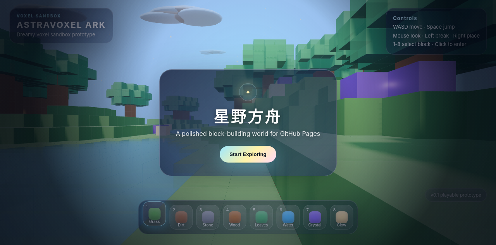

# AstraVoxel Ark / 星野方舟

A polished landscape-first voxel sandbox app built with **Vite + TypeScript + Three.js**, packaged for web, Android, Ubuntu Linux and Windows

玩家可以在梦幻体素浮岛中探索、挖方块、放方块、切换不同材质，并体验柔和日夜循环、雾效、水面、浮云、星光粒子与发光方块

## Play Online

**Play now:** https://lunora-gather.github.io/astra-voxel-ark/



## Features

- Procedural voxel island terrain
- First-person movement with pointer lock on desktop and touch controls on mobile
- Block breaking and placing via raycasting, with player-safe placement checks
- Three local expedition slots with independent reproducible seeds, active-slot autosave, and JSON export/import
- v8 saves resume the player position, view direction, world seed and paused-safe world time
- Mobile virtual joystick, swipe-to-look camera, jump/break/place buttons and tappable hotbar
- Landscape-first phone experience with a rotate-device prompt in portrait mode
- Android shell via Capacitor
- Ubuntu Linux and Windows desktop shells via Electron Builder
- Two-page nine-slot hotbar plus a complete 18-material backpack and direct selection
- Beacon Trail exploration loop: collect landmark shards, repair visible Ark Core modules and strengthen night survival
- Single-player progression with tool tiers, crafting recipes, expedition objectives and claimable rewards
- Four deterministic biomes with layered copper, gold, crystal and obsidian resources
- Worker-planned terrain, resident chunk eviction, and four-tier low-end device scaling
- Health, cold-night damage and Ark recovery
- Dreamy day-night cycle
- Soft fog, shadows, stars, clouds, sparkles, animated water, swaying grass and emissive blocks
- Procedural pixel textures for every block type
- Small code modules for block definitions, procedural textures and terrain math
- Polished glassmorphism HUD and landing panel
- GitHub Pages friendly Vite setup

## Controls

| Action | Key |
|---|---|
| Move | WASD / mobile joystick |
| Look | Mouse / drag right side on mobile |
| Jump | Space / Jump button |
| Sprint | Left Shift |
| Break block | Left click |
| Place block | Right click |
| Select material | 1-9 / mouse wheel / tap hotbar slot |
| Switch material palette | Tab / Palette button |
| Open backpack | E / Game Menu → Expedition |
| Save / Load / Export / Import / Reset | Game Menu |
| Open game menu / unlock mouse | Esc / II button |

## Development

Requires Node.js `^20.19.0` or `>=22.12.0`.

```bash
npm install
npm run dev
npm run verify
```

Set `ASTRA_SMOKE_ARTIFACT_DIR=artifacts/hud-smoke` before `npm run verify` to save HUD smoke screenshots and layout JSON.

## App packaging

```bash
# Ubuntu Linux AppImage + .deb
npm run dist:linux

# Windows installer for x64 and arm64
npm run dist:windows

# Single Windows architecture builds
npm run dist:windows:x64
npm run dist:windows:arm64

# Android debug APK
npm run android:build
```

GitHub `v*` tags publish release assets for Windows x64/arm64, Linux and Android APK. Desktop builds include a Check for Updates menu backed by GitHub Releases. See `PACKAGING.md` for platform-specific notes and output paths.

## Deployment

This repo includes GitHub Actions workflows for GitHub Pages and app package artifacts

1. Push to `main`
2. Open repo Settings → Pages
3. Set Source to **GitHub Actions** if it is not already enabled
4. The site deploys from `dist/`

## Project docs

- `GAME_DESIGN.md` — full design direction
- `PACKAGING.md` — platform packaging notes
- `docs/SINGLEPLAYER_ARCHITECTURE.md` — gameplay boundaries and the reserved multiplayer seam
- `docs/PERFORMANCE_ARCHITECTURE.md` — device tiers, Worker terrain, residency and frame budgets

## Roadmap

- Better chunk meshing for performance
- Building blueprints and richer crafting stations
- Decorative plants and ruins
- Audio and ambient particles
- More polished screenshots and trailer GIF

## License

MIT
